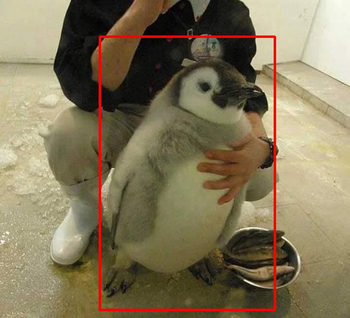
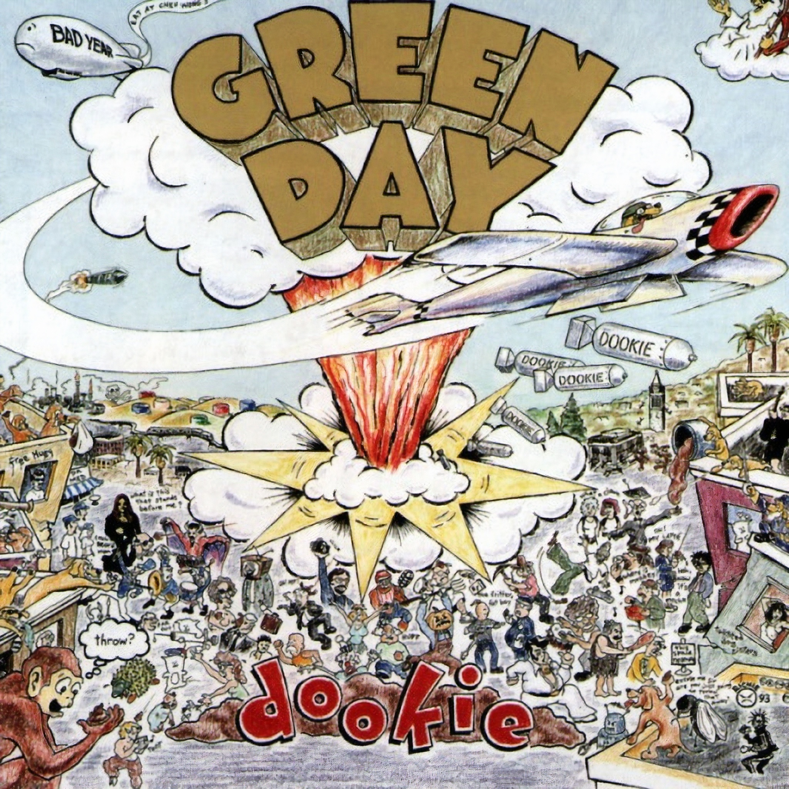
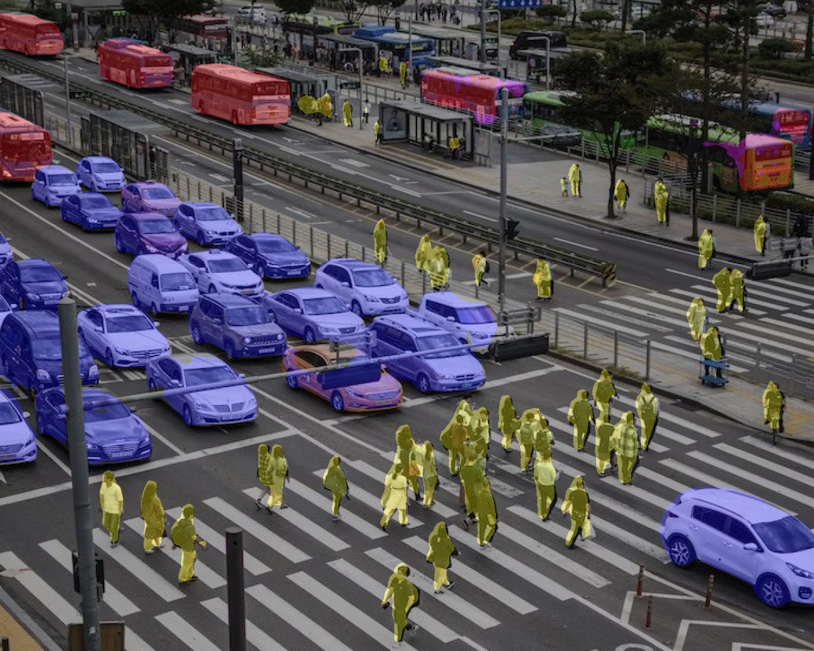

# ANE Examples

## Vision

### Object Detection

[yolov5](https://github.com/ultralytics/yolov5) |
[notebook](vision/notebooks/yolov5.ipynb)

### Super Resolution

[srgan](https://github.com/john-rocky/CoreML-Models#srgan) |
[notebook](vision/notebooks/srgan.ipynb)

512 x 512             |  2048 x 2048
:-------------------------:|:-------------------------:
  |  

### Semantic Segmentation

[fcn](https://pytorch.org/vision/main/models/generated/torchvision.models.segmentation.fcn_resnet50.html) |
[notebook](vision/notebooks/fcn.ipynb)

# Compilation

To obtain hwx sources
either:

	bash download.sh  # curl from my dropbox

or:

[sources.md](sources.md)
